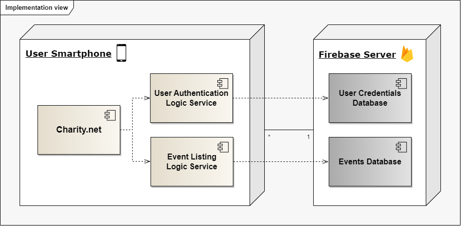

## Architecture and Design

### Logical architecture

#### Charity.net
* **Event Finder Application -** represents the graphical interface of the application (i.e. the various pages, the widgets, etc.)
* **User Authentication Logic -** responsible for the operations behind user authentication, such as linking each user to their Google account and ensuring the correctness of the login
* **Event Scheduling Logic -** all the operations that concern finding, publishing and filtering the volunteering events that appear on the user's timeline

#### External services
* **Event Database API -** service that retrieves the newest volunteering events that are posted on the Internet
* **Firebase -** database that stores the user authentication data

### Physical architecture

* **Charity.net -** the app itself
* **Event Database API -** stores the data relating to charity events
* **Event Listing Logic Service -** responsible for listing events from the database to the users
* **User Credentials Database -** stores the credentions to authenticate into the app
* **User Authentication Logic Service -** handles authentications in the app, using the credentials database
* **Flutter -** open source Google framework used to develop apps in many platforms
* **App Development Framework**

### Vertical prototype
To help on validating all the architectural, design and technological decisions made, we usually implement a vertical prototype, a thin vertical slice of the system.

In this subsection please describe which feature you have implemented, and how, together with a snapshot of the user interface, if applicable.

At this phase, instead of a complete user story, you can simply implement a feature that demonstrates thay you can use the technology, for example, show a screen with the app credits (name and authors).
