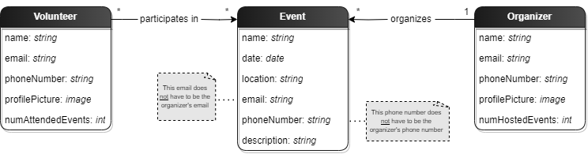

## Requirements

### User stories
We have opted to represent our **user stories** as GitHub issues, since those allow for a more flexible and interactive approach. 
To view them, click [here](https://github.com/FEUP-LEIC-ES-2022-23/2LEIC05T2/issues).

In addition, each user story is associated with a [mockup](https://github.com/FEUP-LEIC-ES-2022-23/2LEIC05T2/tree/main/images/mockups), 
which describes how we plan to approach it in our application.

### Domain model

Our application models the following entities:
* **Volunteer -** user that participates in volunteering events; represents an individual
* **Organizer -** user that organizes volunteering events; it can represent an individual or a company
* **Event -** volunteering event, characterized by its <u>start date</u>, <u>location</u> and <u>type</u>
* **Location -** place where an event occurs, characterized by its <u>coordinates</u> and <u>geographical context</u>

